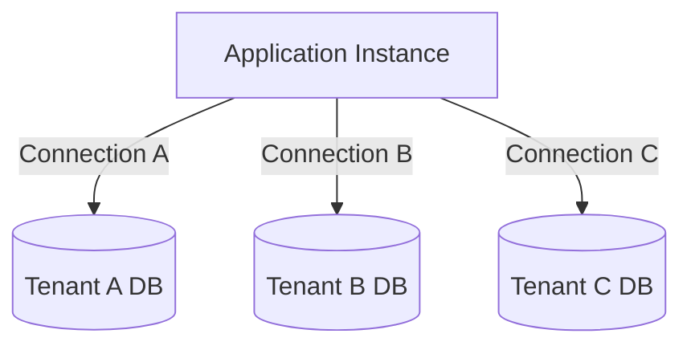
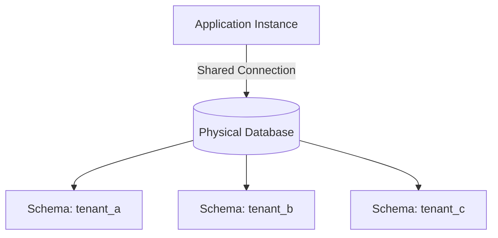
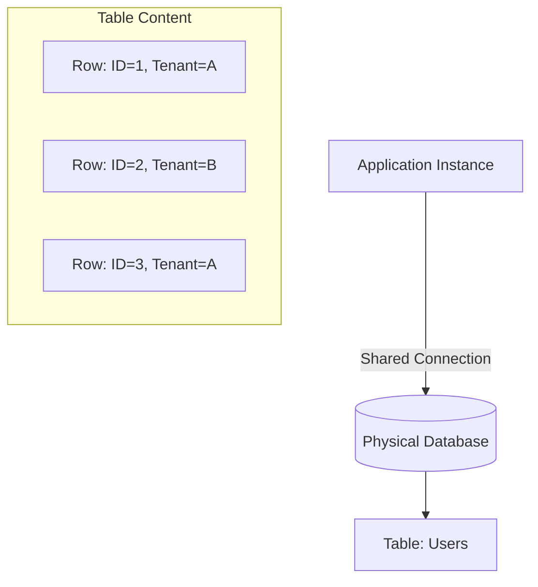
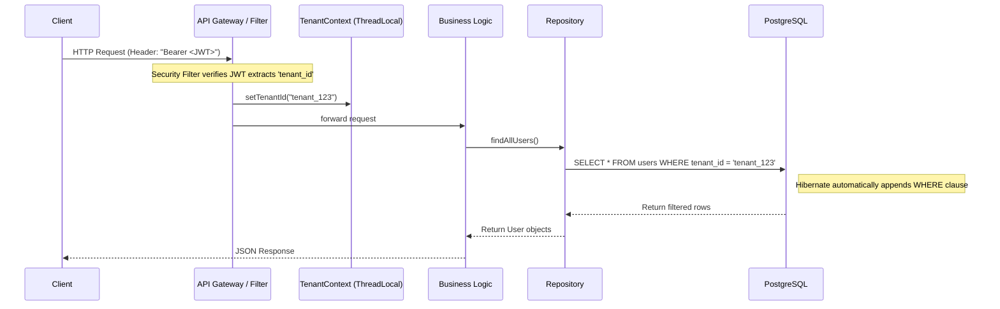

# Part 1: Architecting a Modern SaaS - The Multi-Tenancy Strategy

In the modern landscape of software development, **SaaS (Software as a Service)** has evolved from a buzzword into the de-facto standard for software delivery. Gone are the days of shipping physical binaries or CD-ROMs to customers, expecting them to provision their own servers, manage their own backups, and hire their own IT staff to keep the lights on. Today, we build centralized platforms—clouds, if you will—that serve hundreds, thousands, or even millions of customers simultaneously from a single, unified deployment.

But this fundamental shift in delivery brings with it a fundamental architectural challenge. When you have five different companies (let's call them "tenants") all accessing the same URL and hitting the same backend servers, how do you ensure that Company A absolutely, positively, *never* sees Company B's data? How do you ensure that a complex report run by Company C doesn't crash the server for Company D?

**How do we serve multiple customers (tenants) from a single deployment while ensuring their data remains secure, isolated, and performant?**

This is the challenge of **Multi-Tenancy**. It is the single most important architectural characteristic of any SaaS application. Get it right, and you have a scalable money-printing machine. Get it wrong, and you face data leaks, lawsuits, and a platform that falls over every time a new customer signs up.

In this comprehensive four-part series, we will dissect the architecture of a production-ready Multi-Tenant SaaS application. We won't just talk theory; we will walk through the actual implementation using **Spring Boot 3**, **Hibernate 6**, and **PostgreSQL**, based on the production-grade code in this project.

## The Series Roadmap

We will build this system layer by layer, starting from the database architecture and moving up to the API layer.

*   **Part 1: The Strategy** (You are here) - We will explore the different isolation models, analyze the trade-offs, and explain why we chose the **Shared Schema** approach. We will also lay out the high-level architecture.
*   **Part 2: The Foundation** - We will implement the security layer, securing the application with Spring Security & JWTs. We will learn how to extract tenant identity from incoming requests securely and reliably.
*   **Part 3: Tenant Management** - A SaaS is nothing without tenants. We will build the onboarding flows, provisioning mechanisms, and APIs to manage the lifecycle of our customers.
*   **Part 4: The Core** - The deep dive into the "magic" that makes it all work: `TenantContext`, Hibernate Filters, and the `BaseTenantEntity` implementation that powers our invisible data isolation.

---

## What is Multi-Tenancy?

At its core, multi-tenancy is a software architecture in which a *single instance* of a software application serves multiple customers. Each customer is called a **tenant**. Tenants may be given the ability to customize some parts of the application, such as the branding of their user interface or specific business rules, but they cannot customize the application's core code. Everyone runs the same version of the code.

The defining characteristic of multi-tenancy is **Data Isolation**. Even though Tenant A and Tenant B are using the same running Java process and potentially the same database connection pool, Tenant A must *never* see Tenant B's data. To them, it should feel like they are the only ones on the system. They should feel like they have a dedicated server sitting in a rack somewhere, even though they are actually sharing resources with thousands of others.

### The Business Case: Why Multi-Tenancy?

Before we dive into the code, we must strictly define the *why*. Why not just spin up a new server and database for every new customer? That's how we used to do it in the 90s, right?

1.  **Cost Efficiency**: This is the biggest driver. Sharing resources (servers, load balancers, databases) means drastically lower infrastructure costs. If you have 100 tenants and you spin up 100 EC2 instances and 100 RDS instances, your bill will be 100x higher than if you put them all on one large cluster.
2.  **Operational Simplicity**: In a multi-tenant environment, you upgrade the codebase *once*, and all tenants get the new features instantly. You fix a bug *once*, and it's fixed for everyone. Managing 1,000 separate deployments for 1,000 customers is an operational nightmare that requires a dedicated DevOps army.
3.  **Scalability**: It is paradoxically easier to scale one giant cluster than to manage 1,000 small, fragmented servers. You can optimize resource utilization much better when you have a large pool of resources to draw from.

---

## The Big Decision: Database Isolation Strategies

The most critical technical decision you will make when starting a SaaS project is how to isolate data in the database. This decision is "sticky"—once you pick a path, changing it later requires a massive, painful migration. This decision will dictate your costs, your development velocity, and your operational headaches for years to come.

There are three primary models of isolation, each with its own "flavor" of pros and cons.

### 1. Database per Tenant (The Silo)

In this model, every tenant gets their own completely separate physical database. If you use PostgreSQL, this means a separate `CREATE DATABASE tenant_a;` command for every customer.



*   **Pros**:
    *   **Ultimate Isolation**: It is physically impossible for a query to leak data between tenants if they are in different databases. You can't accidentally `JOIN` across databases.
    *   **Compliance**: This is often required for highly regulated industries like Healthcare (HIPAA), Finance, or Government. Some customers simply demand their data sits in its own box.
    *   **Disaster Recovery**: You can restore Tenant A's backup to a specific point in time without affecting Tenant B.
    *   **Noisy Neighbor Protection**: If Tenant A runs a massive query, they primarily hurt their own database interactions (though they might still contend for shared IOPS if on the same disk).
*   **Cons**:
    *   **Resource Waste**: 1000 tenants = 1000 databases. Even if they are idle, they consume memory and connection overhead.
    *   **Operational Nightmare**: Imagine running a schema migration script (like Flyway or Liquibase). You have to run it 1000 times. If it fails on tenant #456, what do you do? Do you roll back the previous 455?
    *   **Cost**: Cloud providers often charge for provisioned resources per database instance. This is the most expensive model by far.

### 2. Schema per Tenant (The Bridge)

In this model, we use a single physical database instance, but we create a separate **Schema** (namespace) for each tenant. In PostgreSQL, this looks like `CREATE SCHEMA tenant_a;`, `CREATE SCHEMA tenant_b;`. The tables (Users, Orders, etc.) are duplicated in each schema.



*   **Pros**:
    *   **Logical Isolation**: Data is separated into different buckets. It's much harder to accidentally leak data than in the Shared Schema model.
    *   **Shared Resources**: Better utilization of the CPU and RAM of the DB server compared to Database-per-Tenant.
*   **Cons**:
    *   **Tooling Complexity**: Hibernate and migration tools can be tricky to configure for multi-schema. You need a mechanism to dynamically switch the "default schema" for the JDBC connection at runtime based on the incoming request.
    *   **Connection Pooling**: This is the killer. Connection pools (like HikariCP) are designed to hold connections to a *database*. Switching schemas on a connection is widely considered an "expensive" operation and can lead to complex pooling strategies or connection leaks.

### 3. Shared Schema (The Pool)

In this model, everyone swims in the same pool. We have **one database** and **one schema**. Every single table that contains tenant-specific data has a discriminator column, typically named `tenant_id`.



*   **Pros**:
    *   **Maximum Efficiency**: Highest density of tenants per server. You can host thousands of tenants on a modest database server. This offers the best cost-to-serve ratio, which is vital for startups.
    *   **Simplicity**: It's just standard SQL. No complex connection routing, no schema switching contexts.
    *   **Evolution**: Schema changes happen once. When you add a column, you add it for everyone instantly.
*   **Cons**:
    *   **"Noisy Neighbor" Risk**: One heavy tenant can slow down queries for everyone else because they are literally querying the same table.
    *   **The "Leak" Risk**: The biggest danger. If a developer writes a query and forgets `WHERE tenant_id = ?`, they might return *all* data. This is a catastrophic security breach.

### The Verdict for Our Project

For 95% of B2B SaaS startups, **Shared Schema** is the correct choice. The operational agility, low cost, and ease of deployment far outweigh the risks, *provided*—and this is a big proviso—you have a robust, automated way to prevent data leaks. **You cannot rely on developer discipline.** You need architectural enforcement.

This is the approach we have chosen for this project. We will mitigate the "Leak Risk" using Hibernate Filters, which we will detail below.

---

## Deep Dive: The Shared Schema Architecture

We have chosen the Shared Schema approach. Strategies are great, but implementation is where the bugs live. How do we solve the "Leak Risk" effectively? We cannot rely on developers remembering to add `WHERE tenant_id = 'xyz'` to every single SQL query. Humans make mistakes, and in this architecture, a mistake is fatal.

Instead, we implement **Application-Level Isolation** using Aspect-Oriented Programming (AOP) principles and Framework mechanisms.

### The Logical Flow of a Request

1.  **Request Entry**: A user makes an API request (e.g., `GET /api/users`) containing a JWT (JSON Web Token) in the Authorization header.
2.  **Authentication**: The Spring Security filter chain intercepts the request. It validates the signature of the JWT to ensure it hasn't been tampered with.
3.  **Context Extraction**: A specialized filter extracts the `tenant_id` claim from the JWT. This claim was burned into the token when the user logged in.
4.  **Context Setting**: This ID is stored in a `ThreadLocal` container called `TenantContext`. This is a global static accessor that is unique to the current thread handling the request.
5.  **Data Access**: The controller calls a service, which calls a repository. When the repository attempts to fetch data, Hibernate (our ORM) automatically intercepts the query.
6.  **Filter Enforcement**: Hibernate checks if the `TenantContext` has an ID. If so, it transparently appends `AND tenant_id = '...'` to the SQL query before sending it to the database.

### The Code: A Sneak Peek

Let's look at the core Java components that make this possible in our codebase. Understanding these now will make the rest of the series much easier to follow.

#### 1. The Entity Strategy: `BaseTenantEntity`

To standardize the shared schema, every single entity in our system that belongs to a tenant must have a `tenant_id`. We don't want to repeat this field definition in every single domain class (User, Product, Order, etc.).

In `src/main/java/cloud/norgha/multi_tenant_saas_starter_template/multitenancy/persistence/BaseTenantEntity.java`, we define a generic superclass.

```java
@MappedSuperclass
public class BaseTenantEntity {

    @Column(name = "tenant_id", nullable = false, updatable = false)
    private String tenantId;

    protected BaseTenantEntity(){}

    public String getTenantId() {
        return tenantId;
    }

    @PrePersist
    protected void assignTenant(){
        String currentTenant = TenantContext.getTenantId();

        if(currentTenant == null){
            throw new TenantMissingException("TenantContext not set...");
        }

        this.tenantId = currentTenant;
    }
}
```

**Why this is powerful:**
*   **Enforcement**: The `@PrePersist` hook ensures that we *cannot* save an entity without a tenant ID. If the context is missing (e.g., a background job running without a tenant context), the save fails immediately with a `TenantMissingException`, protecting data integrity.
*   **Immutability**: `updatable = false` ensures that an object cannot "move" from one tenant to another. Once a record is born in Tenant A, it stays in Tenant A forever.

#### 2. The Implementation: `User` Entity

Here is how we use it in `User.java`. Notice the Hibernate specific annotations. These are crucial.

```java
@Entity
@Table(name = "users")
@FilterDef(name = "tenantFilter", parameters = @ParamDef(name = "tenantId", type = String.class))
@Filter(name = "tenantFilter", condition = "tenant_id = :tenantId")
public class User extends BaseTenantEntity {
    // ... fields like password, email, etc.
}
```

*   `@FilterDef`: Defines a portable filter definition named `tenantFilter`. It takes a parameter `:tenantId`. Ideally, this is defined in a `package-info.java` to apply globally, but here we see it on the entity for clarity.
*   `@Filter`: Applies this filter to the entity. The condition `tenant_id = :tenantId` is the magic. When enabled, Hibernate appends this clause to *every* generated SQL query (SELECT, UPDATE, DELETE) for this entity.

#### 3. The ThreadLocal Context

How does the application know *which* tenant is currently active? We use `TenantContext`.

```java
public final class TenantContext {
    private static final InheritableThreadLocal<String> CURRENT_TENANT = new InheritableThreadLocal<>();

    public static void setTenantId(String tenantId) {
        CURRENT_TENANT.set(tenantId);
    }
    // ...
}
```

We use `InheritableThreadLocal` rather than a simple `ThreadLocal`. Why? Because if the main request thread spawns a new thread (for example, to send an async email or process a background task), the child thread intuitively "inherits" the tenant context from the parent. This prevents mysterious "Tenant Missing" errors when you start doing parallel processing.

---

## Architectural Diagram

Here is the complete request flow in our Shared Schema architecture, visualizing how the pieces fit together:



## Challenges and Solutions in Shared Schema

While Shared Schema is efficient, it is not without pitfalls. Here are three specific challenges we encountered and solved in this project.

### 1. The "Super Admin" Problem
Sometimes, you *need* to see everything. A System Admin might need to find a user by email across *all* tenants to help debug an issue. Or you might want to run a global analytics report.
*   **Solution**: We implement a mechanism to explicitly `disableTenantFilter()` for specific administrative transactions. This is handled in our `HibernateTenantFilterConfigurer` bean. We can wrap these administrative calls in a specialized aspect or service method that temporarily bypasses the safety filters.

### 2. Unique Constraints
If you enforce `unique = true` on the `email` column, you might accidentally prevent two different tenants from having a user with the same email.
*   **Scenario**: Tenant A has an employee "john@example.com". Tenant B also wants to hire "john@example.com". If `email` is globally unique, Tenant B fails.
*   **Solution**: Unique constraints must always be **Composite Constraints** including the `tenant_id`.
    *   Bad: `UNIQUE(email)`
    *   Good: `UNIQUE(tenant_id, email)`
    This allows the same email to exist in different tenants, which is exactly what we want.

### 3. Data Leaks via Native Queries
Hibernate Filters are great, but they have a limitation: they *do not* apply to raw SQL (Native Queries) effectively unless manually added.
*   **Risk**: A developer writes `@Query(value = "SELECT * FROM users", nativeQuery = true)`. Hibernate passes this string directly to the DB. The filter is bypassed. ALL users are returned.
*   **Solution**: We strictly ban the use of Native Queries for everyday business data fetching. If a native query is absolutely necessary (e.g., for complex reporting or performance), it must undergo strict code-review to ensure `tenant_id` is manually handled in the WHERE clause.

---

## Conclusion

We have established the strategy. We are building a high-performance, cost-effective SaaS using the **Shared Schema** model. We have designated `tenant_id` as our discriminator and set up `BaseTenantEntity` to enforce it at the database level.

This architecture gives us the best balance of speed, cost, and maintainability.

But an architecture is useless without a way to identify *who* is making the request. How do we get that `tenant_id` securely into the `TenantContext`? How do we prevent a user from simply sending a fake `tenant_id` in a header?

In **Part 2**, we will build the foundation of our security system. We will configure **Spring Security** and implement **JSON Web Tokens (JWT)** to securely transmit tenant identity and handle authentication.

Stay tuned.
